# 视频翻译处理系统设计文档

## 概述

本系统旨在将中文视频通过阿里云千问qwen-omni-turbo模型进行实时翻译，输出包含英文字幕和英文语音的视频文件。系统将处理videos/cn-agent.mp4文件，提取音频进行翻译，并生成新的包含英文音频和字幕的mp4文件。

### 核心价值
- 实现高质量的中文到英文视频翻译
- 保持视频画面完整性的同时替换音频轨道
- 提供准确的英文字幕同步显示
- 利用千问模型的视觉增强能力提升翻译质量

### 技术特性
- 支持实时音频翻译（延迟低至3秒）
- 视觉增强翻译（利用画面信息提升准确性）
- 多模态输出（文本+音频）
- 自然语音合成

## 技术架构

### 系统组件架构

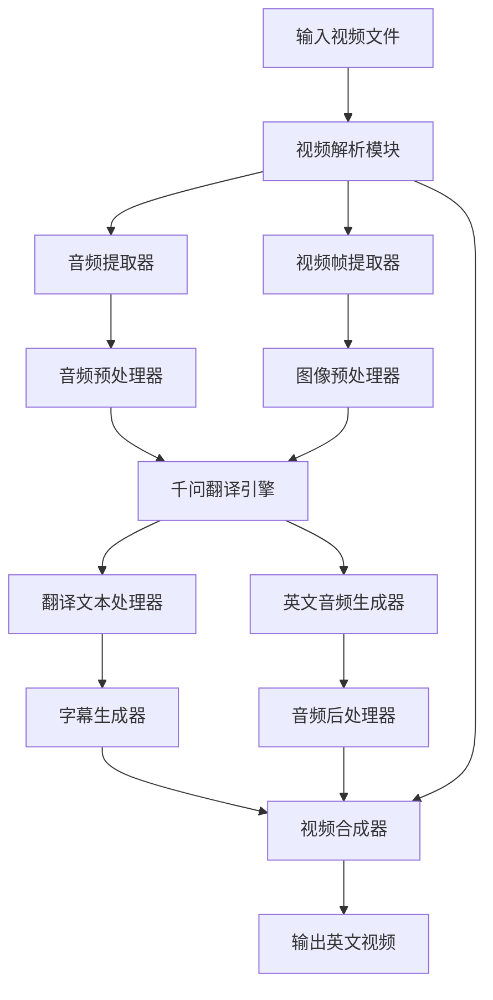

### 数据流架构

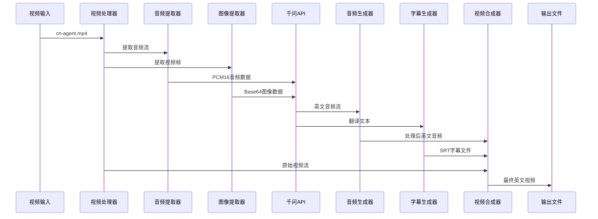

## 核心模块设计

### 视频处理模块

#### 视频解析器
| 功能 | 描述 |
|------|------|
| 格式检测 | 检测输入视频的编码格式、分辨率、帧率等参数 |
| 流分离 | 分离视频流、音频流和字幕流 |
| 元数据提取 | 提取视频时长、比特率等元信息 |

#### 音频提取器
| 参数 | 值 | 说明 |
|------|-----|------|
| 采样率 | 16000 Hz | 千问模型要求的音频采样率 |
| 格式 | PCM16 | 16位PCM格式 |
| 声道 | 单声道 | 简化处理复杂度 |
| 块大小 | 1600 字节 | 每次发送的音频数据块大小 |

#### 视频帧提取器
| 参数 | 值 | 说明 |
|------|-----|------|
| 提取频率 | 2帧/秒 | 平衡性能和翻译质量 |
| 图像格式 | JPEG | 便于Base64编码传输 |
| 分辨率 | 保持原始 | 维持视觉上下文信息 |

### 翻译引擎模块

#### 千问API接口层
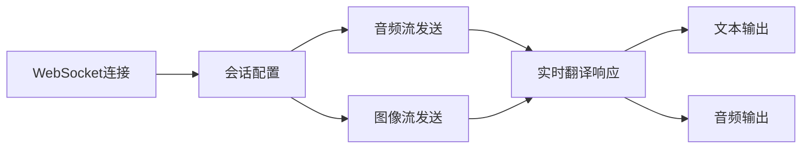

#### API配置参数
| 配置项 | 值 | 描述 |
|--------|-----|------|
| 模型名称 | qwen3-livetranslate-flash-realtime | 实时音视频翻译模型 |
| 目标语言 | en (英语) | 翻译输出语言 |
| 输出模态 | ["text", "audio"] | 同时输出文本和音频 |
| 音色配置 | Cherry | 自然女声音色 |
| 输入音频格式 | pcm16 | 16位PCM格式 |
| 输出音频格式 | pcm16 | 16位PCM格式 |

#### 翻译流程控制
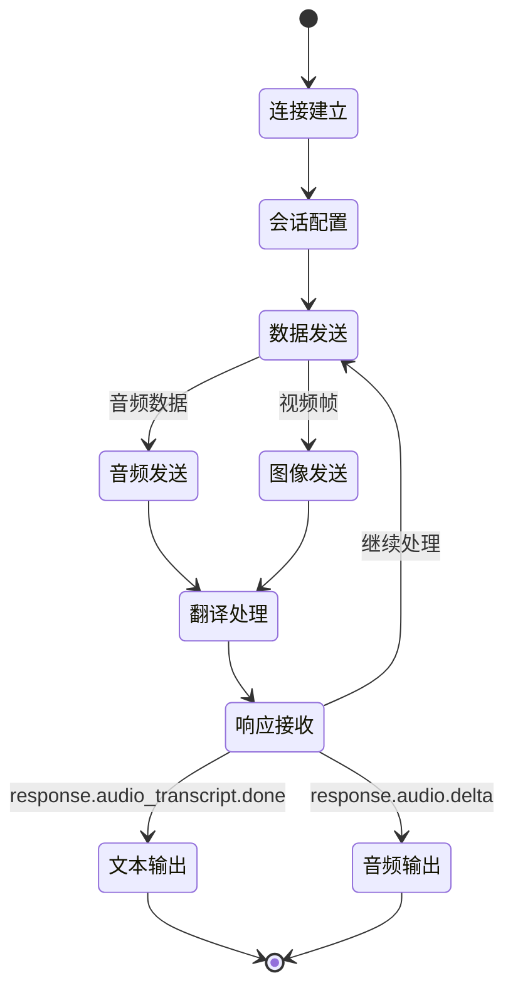

### 音频处理模块

#### 音频预处理器
| 处理步骤 | 说明 |
|----------|------|
| 格式转换 | 将原始音频转换为16kHz PCM16格式 |
| 音频分段 | 按1600字节块大小分割音频数据 |
| 质量检测 | 检测音频质量，过滤静音段 |

#### 英文音频生成器
| 参数 | 值 | 说明 |
|------|-----|------|
| 输出采样率 | 24000 Hz | 千问模型输出音频采样率 |
| 输出格式 | PCM16 | 16位PCM格式 |
| 声道数 | 单声道 | 与输入保持一致 |
| 缓冲区大小 | 2400 字节 | 音频播放缓冲区大小 |

#### 音频同步机制
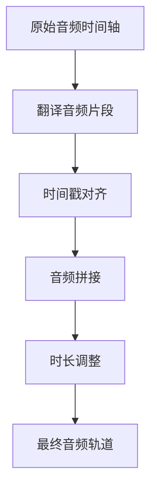

### 字幕生成模块

#### 字幕时间轴生成
| 组件 | 功能 |
|------|------|
| 时间戳提取器 | 从音频分段中提取准确的开始和结束时间 |
| 文本分段器 | 将翻译文本按合理长度分段 |
| 同步校准器 | 确保字幕与音频完美同步 |

#### 字幕格式处理
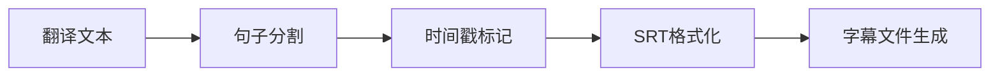

#### SRT字幕结构
| 字段 | 格式 | 示例 |
|------|------|------|
| 序号 | 数字 | 1 |
| 时间码 | HH:MM:SS,mmm --> HH:MM:SS,mmm | 00:00:01,000 --> 00:00:03,500 |
| 字幕内容 | UTF-8文本 | Hello, this is a translation. |

### 视频合成模块

#### 合成器架构
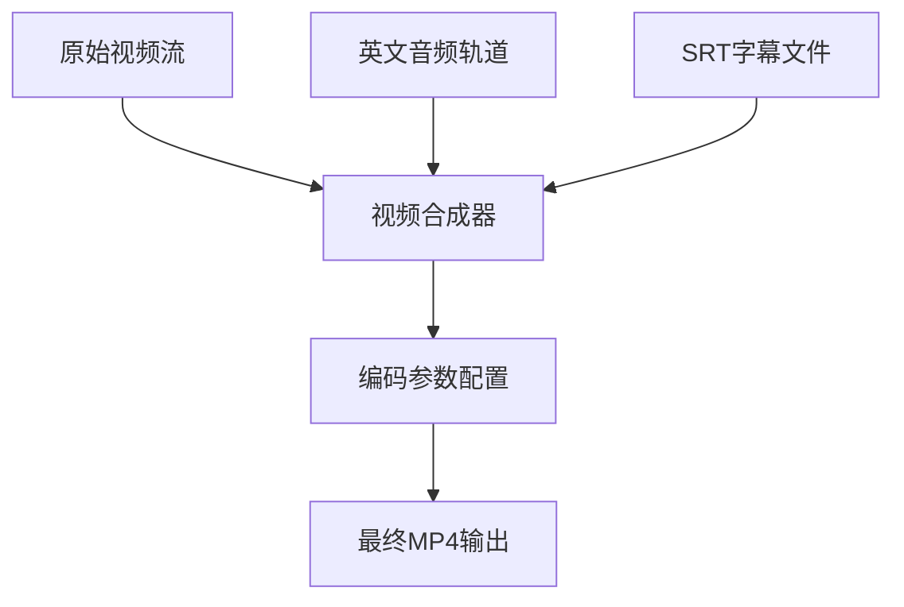

#### 编码配置
| 参数 | 值 | 说明 |
|------|-----|------|
| 视频编码器 | H.264 | 广泛兼容的视频编码格式 |
| 音频编码器 | AAC | 高质量音频编码格式 |
| 容器格式 | MP4 | 标准视频容器格式 |
| 视频比特率 | 保持原始 | 维持原有视频质量 |
| 音频比特率 | 128kbps | 高质量音频输出 |

## 处理流程设计

### 主要处理流程

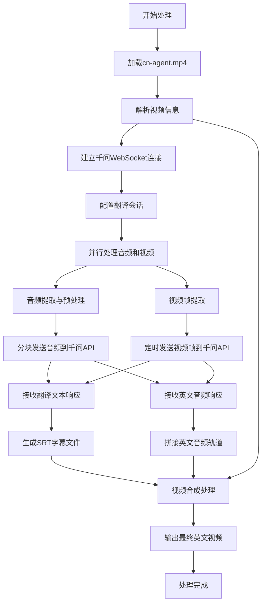

### 错误处理流程

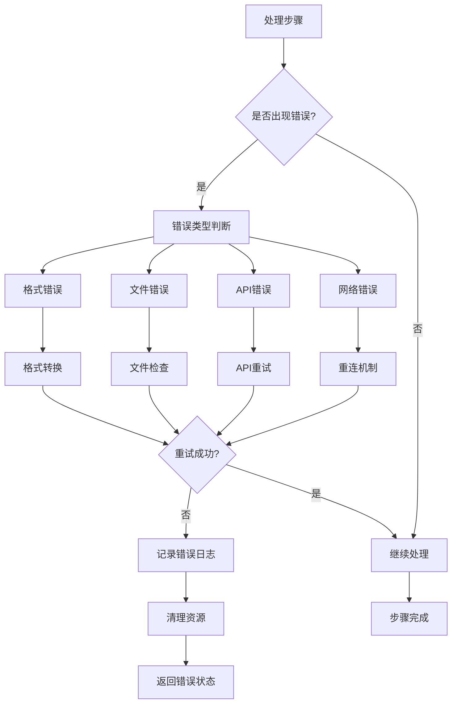

### 性能优化策略

#### 并行处理设计
| 优化点 | 策略 | 预期效果 |
|--------|------|----------|
| 音频处理 | 流式处理，边提取边发送 | 减少内存使用，提高处理速度 |
| 视频帧处理 | 异步提取和发送 | 避免阻塞音频处理 |
| API调用 | 连接复用，批量处理 | 降低网络延迟 |
| 内存管理 | 分块处理，及时释放 | 避免内存溢出 |

#### 缓存机制
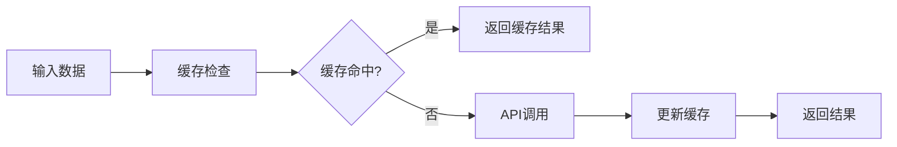

## 配置参数设计

### 系统配置参数

| 配置分类 | 参数名 | 默认值 | 说明 |
|----------|--------|--------|------|
| API配置 | DASHSCOPE_API_KEY | 环境变量 | 阿里云百炼平台API密钥 |
| API配置 | API_URL | wss://dashscope.aliyuncs.com/api-ws/v1/realtime | 千问API WebSocket地址 |
| API配置 | MODEL_NAME | qwen3-livetranslate-flash-realtime | 翻译模型名称 |
| API配置 | TARGET_LANGUAGE | en | 目标翻译语言 |
| API配置 | VOICE_TYPE | Cherry | 语音合成音色 |
| 音频配置 | INPUT_SAMPLE_RATE | 16000 | 输入音频采样率 |
| 音频配置 | OUTPUT_SAMPLE_RATE | 24000 | 输出音频采样率 |
| 音频配置 | AUDIO_CHUNK_SIZE | 1600 | 音频数据块大小 |
| 视频配置 | FRAME_EXTRACT_RATE | 2 | 视频帧提取频率(帧/秒) |
| 视频配置 | OUTPUT_VIDEO_QUALITY | high | 输出视频质量 |
| 处理配置 | MAX_RETRY_COUNT | 3 | 最大重试次数 |
| 处理配置 | TIMEOUT_SECONDS | 30 | 超时时间(秒) |

### 运行时配置

| 配置项 | 类型 | 说明 |
|--------|------|------|
| 输入文件路径 | 字符串 | videos/cn-agent.mp4 |
| 输出文件路径 | 字符串 | output/cn-agent-en.mp4 |
| 临时文件目录 | 字符串 | temp/ |
| 日志级别 | 枚举 | INFO/DEBUG/WARNING/ERROR |
| 并发处理数 | 整数 | 根据系统性能调整 |

## 质量保证设计

### 翻译质量控制

#### 质量评估指标
| 指标 | 评估方法 | 目标值 |
|------|----------|--------|
| 翻译准确性 | 人工评估+自动评分 | >90% |
| 音频同步性 | 时间戳偏差检测 | <100ms |
| 语音自然度 | 韵律分析 | >4.0/5.0 |
| 处理速度 | 耗时测量 | <视频时长的2倍 |

#### 质量保证流程
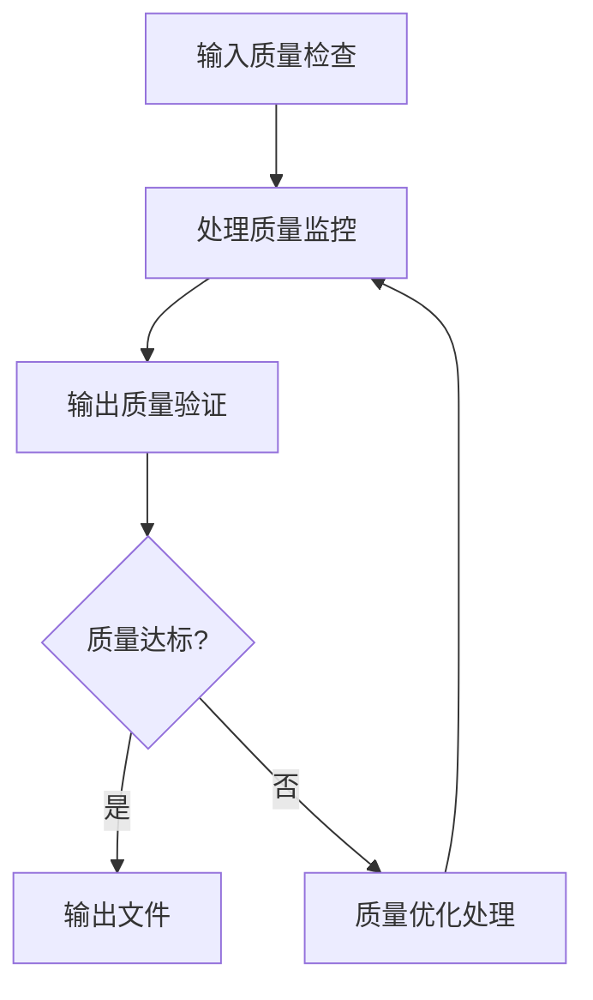

### 错误处理与恢复

#### 异常分类与处理
| 异常类型 | 处理策略 | 恢复机制 |
|----------|----------|----------|
| 网络连接异常 | 自动重连 | 指数退避重试 |
| API调用超时 | 重新发送 | 分段重试 |
| 音频格式异常 | 格式转换 | 自动转码 |
| 内存不足 | 分批处理 | 释放缓存 |
| 文件损坏 | 跳过片段 | 标记错误位置 |

#### 监控与日志
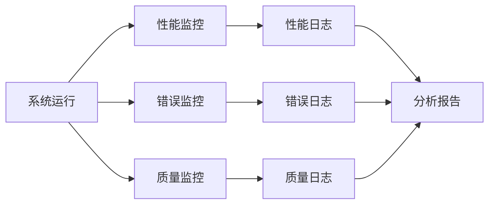

## 测试策略

### 功能测试

#### 测试用例分类
| 测试类型 | 测试场景 | 验证点 |
|----------|----------|--------|
| 基础功能 | 标准中文视频翻译 | 完整流程执行成功 |
| 边界测试 | 超长视频处理 | 内存和性能稳定性 |
| 异常测试 | 网络中断恢复 | 错误处理和恢复能力 |
| 兼容性测试 | 不同格式视频 | 格式支持范围 |
| 性能测试 | 大文件处理 | 处理速度和资源使用 |

#### 测试数据准备
| 测试文件 | 特征 | 用途 |
|----------|------|------|
| 短视频(30秒) | 清晰语音 | 基础功能验证 |
| 中等视频(5分钟) | 多场景对话 | 翻译质量测试 |
| 长视频(30分钟) | 复杂内容 | 性能压力测试 |
| 低质量视频 | 噪音干扰 | 鲁棒性测试 |

### 性能测试

#### 性能基准
| 性能指标 | 测试方法 | 期望结果 |
|----------|----------|----------|
| 处理速度 | 多文件批量测试 | 实时处理比例 >0.5x |
| 内存使用 | 内存监控 | 峰值 <2GB |
| CPU使用率 | 系统监控 | 平均 <80% |
| 网络带宽 | 流量统计 | 合理利用带宽 |

### 集成测试

#### 端到端测试流程
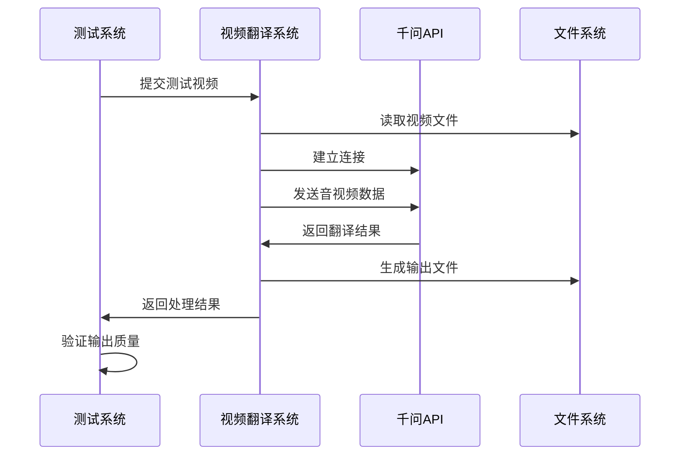